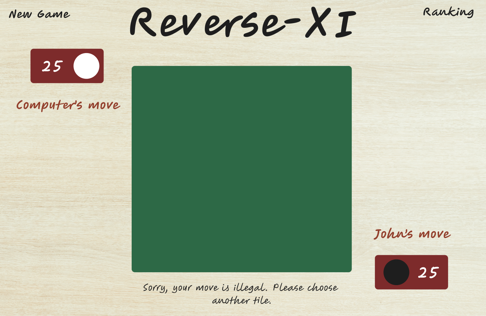
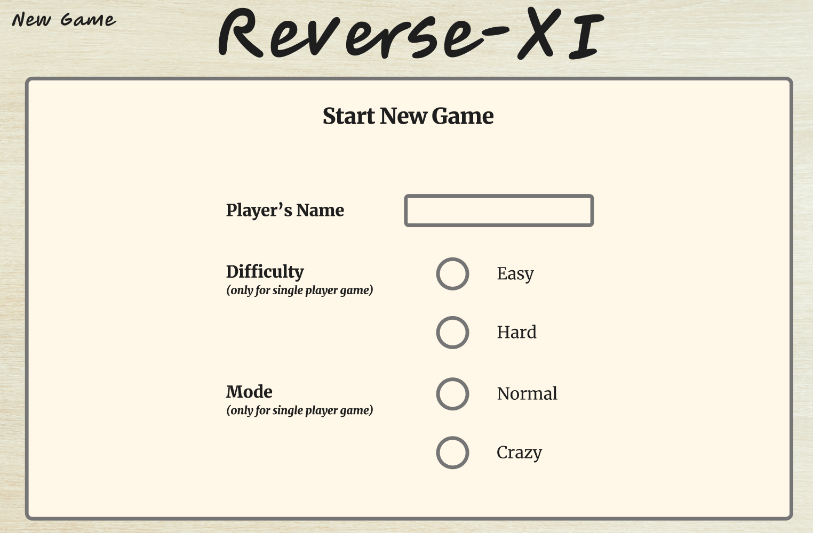

# Reverse-XI

## What is Reverse-XI?

Reverse-XI is a variant of Reversi, a classic 8x8 board game for 2 players. In this version, player will play with a computer which provides varying levels of difficulty. Player can also choose to play with a larger board of 10x10 or 12x12 for a more satisfying duration. Reverse-XI also have a crazy mode, where a random seed from the player and a random seed from the computer are flipped on the every 10th turn, giving unexpected twists in the gameplay.

Play the game at https://yl-ang-hub.github.io/game-reverse-xi/

## Planning Process

### Tech Stack

- Using HTML, CSS and vanilla Javascript

### User Stories / Requirements

- Player will see the landing page.
- Player is able to start an 1-player game and key in their username.
- Player with the black seed will start the first move.
  - If the move is illegal, an alert will be displayed.
  - If the move is legal, “captured” seeds will flip.
- Computer with the white seed will take the next move, and the game will proceed with the both players taking turns.
- Once any of the following conditions are met, game will end:
  - No more legal moves for both players.
  - Game board is completely filled with seeds.
- Once the game ends, an alert will show:
  - Display winner and loser, and the final number of white vs black seeds.
  - Player is able to start a new game.

### Stretch Goals

- Player is able to customise the size of the board for a longer game
- Player can choose a different difficulty if they want a bigger challenge
- Add at least a fun mode to the game (different from the usual Reversi)

### Future Goals (maybe)

- Instead of playing with a computer, add an option for 2 friends to play with each other online
- Add a ranking board for strangers to compete on the fastest win and the most seeds captured, for the respective difficulty levels
- Further improve the animations

### Attributions

- Background image: [Designed by Freepik](https://www.freepik.com/free-photo/wooden-textures-background_4011405.htm#fromView=search&page=1&position=48&uuid=fecd2c87-252c-4b5c-8c0f-172a77adde29&query=wood+background+)

## Design

### Structuring the Code

- To provide some organisation (also making it easier for my brain to navigate around and understand), I planned to divide the JavaScript into three different files that will handle three key areas:
  1. app.js - Interfacing with the HTML/CSS on the display and events
  2. logic.js - Handling the main logic of the gameplay
  3. computer.js - Handling the main logic for the computer player

### Planning the User Interface

- With the gameplay, rules, user stories and game requirements in mind, I tried to plan out the overall look and feel of the game before starting to structure and code the HTML for the page.
- Board view
  
- Game Options
  

## Implementation

### Setting Up the Gameplay

- First, the necessary variables are set up and the board is rendered on the page. Since I have to track a minimum of 64 squares and render the state of each square onto the window, I decided to use a nested array (`board`) to track the state of each square (i.e., empty, occupied by player, occupied by computer). That will also help subsequent manipulation since it is similar to how the DOM is set up to render the board. In my code, the size of the board is soft-coded so that I could easily add a feature to allow user to set a variable board size (e.g. 10x10 or 12x12).
- By default, the user will start the game by making the first move with the black seed. So the display will show whose turn it is and a message box to convey information to the player (for example, an illegal move).

### Checking for Captured Opponent’s Seeds in All Directions

- When the seed is placed, the game must first check if it is a legal move in which at least 1 opponent’s seed will be captured. Otherwise, the game should block the move and advise the player to make another move that is legal.
- While writing a long code to manually check for all of the 8 possible directions is possible, it will be harder to maintain and challenging for future game upgrades (e.g. implementing creative rules or challenging levels). As such, it would be more elegant to tap on a recursive function (`checkMove()`) to perform a check in all directions.
- Since the logic for checking for captured seeds in all directions is similar to the logic for checking if the move can legally capture more than 1 opponent’s seeds, the recursive function is designed to be used for both use cases. For example, if the intent is just to check whether a player has any available legal move left during their turn, then the same function can be invoked and be requested to terminate once _one legal move_ is found (toggled through an argument). This avoids unnecessary checking in every directions and improves the game efficiency.

### Checking for End Game

- At the end of every turn, the game needs to check if
  1. there is any legal move left for the player and the opponent
  - Any side without legal move left will be skipped for that turn. If both sides have no legal move left, then the game will end.
  - First, the game will identify all the empty squares. Then the same recursive function (`checkMove()`) is utilised to check if any of the empty squares constitute a legal move.
  2. the board still have empty squares for the game to continue
- Once both conditions cannot be met, then it means that the game has ended. The game will trigger an end game sequence to calculate the winner and display on the screen.

### Designing for a Computer Opponent

- I started off by determining what is a minimally viable computer opponent - essentially the computer opponent should be able to "see" the empty squares on the board, decide on a square that can constitute a legal move (i.e., captures >= 1 player's seed) and make the move.
- To code that, I created a function where the computer opponent can filter out the empty squares on the board. By using `checkMove()` on each of the square, those squares that can make a legal move is further distilled. Then one of the squares is randomly selected as the computer's move.
- During testing, I realised that the computer is playing too fast and the player has no time to register the move. To add some delay and simulate "thinking" for my computer opponent, I added time delay for the computer's moves.

### Creating Different Levels of Difficulty

- I was hoping to create more challenge for the experienced players that might play Reverse-XI. Hence, the computer opponent will need to be "smarter". The minimally viable computer opponent is only good enough as "Easy" in terms of difficulty.
- To create an intermediate level of difficulty, I made a small change. Instead of randomly selecting a move, the computer opponent will always select the move that captures the most number of seeds from the player.
  - Based off the recursive `checkMove()` function, I created a similar one to return the total number of seeds captured from player instead. Then the move with the maximum seeds captured will be selected as the computer's move.
- To further build on that to create a hard level of difficulty, I applied a multiplier on the number of captured seeds _based on the strategic value of the square_:
  - x10 if the square is located at the 4 corners
  - x0.1 if the square is located around the 4 corners
  - x3 if the square is located at the border

### Developing a Crazy Mode

- Sometimes classic reversi can feel repetitive, so I wanted a different mode that could add a twist.
- I created a crazy mode in which a random seed from the player and a random seed from the computer will be flipped on the every 10th turn. This creates interesting scenarios in which seeds located in strategic locations (e.g. corner) are suddenly lost and the player will have to figure out how to turn the game around.
- First thing first, I added a variable to track the number of turns made.
- Then at the end of the 10th turn, the interaction with the board is disabled so player cannot make any move. That is when the game will identify the seeds belonging to player and computer respectively, then randomly select one of each to flip.
- As I was testing the game, I realised that the player is given little indication of when this is happening and the seeds are flipped too fast for the player to register. So I added in time delay at every step, greyed out the seeds counters when I disabled the interaction with the board, highlight the selected seeds for at least 3 seconds or so to "warn" the player before they are flipped etc. All these served to increase user experience and playability.
